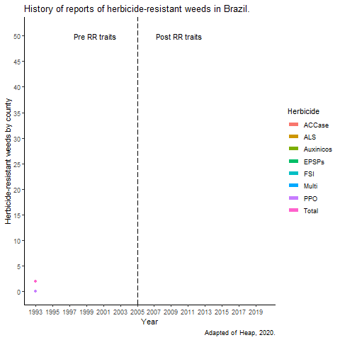

# Vitor Muller Anunciato

* Doutorando pela [FCA/UNESP](https://www.fca.unesp.br/) - Botucatu, BR.
  + (Sanduiche University of Nebraska Lincoln, EUA).
  
* Mestrado pela [FCA/UNESP](https://www.fca.unesp.br/) - Botucatu, BR.

* Graduacao pela [UEL](http://portal.uel.br/home/) - Londrina, BR.
  + (Sanduiche ENGEES, Strasbourg, FR).

* [Serial Weed Killer](https://serialweedkiller.netlify.app/)
  + (site de divulgacao agro-cientifica)
  
* [PapoAgro podcast](https://www.papoagro.com.br/) (@papoagropodcast)
---
class: inverse, center, middle

# O que e resistência de plantas a herbicidas?
---
class:middle

.pull-right[Anunciato, V.M. 2017]

---
# Como a surge a resistência?
**Pressão de seleção** é qualquer conjunto de fatores (aplicacao de um determiando herbicida) que origina o favorecimento de determinados **genes** em relação a outros em determinada **população**.
  

---
class: center, midle

# O que fazemos de errado para surgir a resistência? 

Se você só conhece o **martelo** todo problema é um **prego**.
---

* O consecutivo e indiscriminado uso do glyphosate elevou a pressão de seleção para as populações resistentes a esse herbicida.

---
class: inverse, center, middle

#Mecanismos comuns de resistência das plantas daninhas a herbicidas
---
.pull-left[...]

---
class: inverse, center, middle

# Referências
---
Heap, I.  The International Herbicide-Resistant Weed Database.  Online.  Wednesday, October 14, 2020 .  Available  www.weedscience.org Copyright © 1993- 2020 WeedScience.org All rights reserved. 

Alcántara-de la Cruz, Ricardo, Guilherme Moraes de Oliveira, and Leonardo Bianco de Carvalho. ["Herbicide Resistance in Brazil: Status, Impacts, and Future Challenges."](https://www.intechopen.com/online-first/herbicide-resistance-in-brazil-status-impacts-and-future-challenges) Herbicides-Current Research and Case Studies in Use. IntechOpen, 2020.

DE CARVALHO, Leonardo Bianco et al. Pool of resistance mechanisms to glyphosate in Digitaria insularis. Journal of agricultural and food chemistry, v. 60, n. 2, p. 615-622, 2012.

